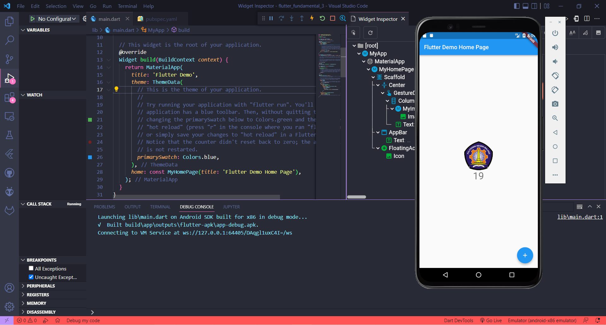
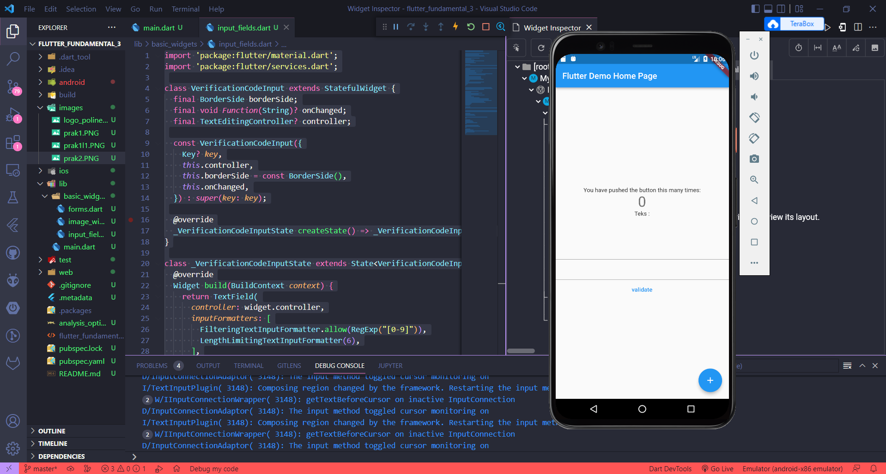
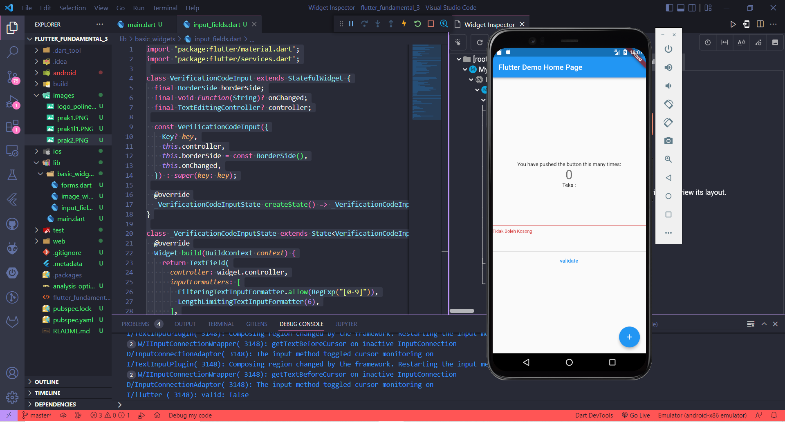
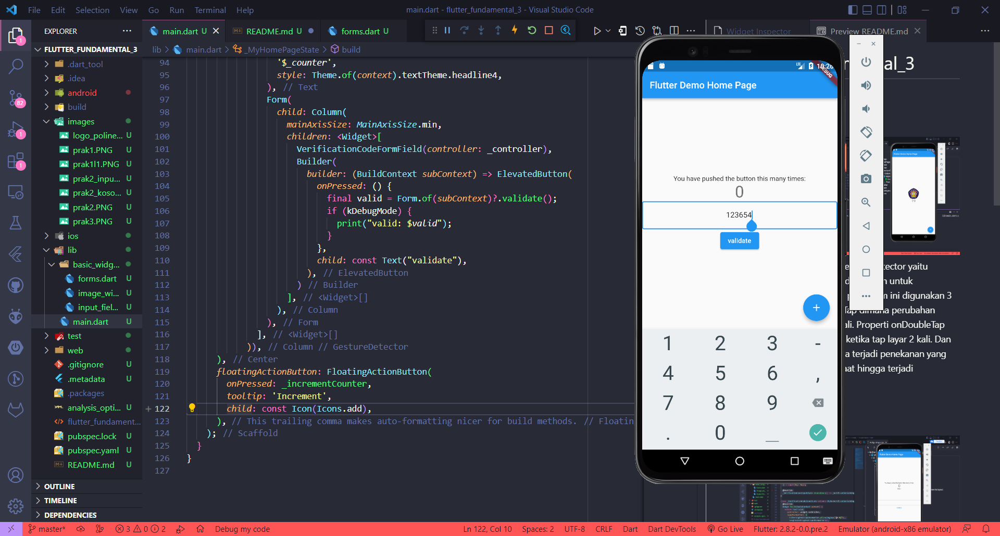

# flutter_fundamental_3

A new Flutter project.

## PRAKTIKUM 1

Praktikum ini digunakan gesture detector yaitu penggunaan widget yang digunakan untuk mendeteksi gerakan. Pada praktikum ini digunakan 3 properti berbeda yaitu onTap dimana perubahan terjadi ketika tap layar 1 kali. Properti onDoubleTap dimana perubahan terjadi ketika tap layar 2 kali. Dan onLongPress dimana ketika terjadi penekanan yang ditahan untuk beberapa saat hingga terjadi perubahan. 

## PRAKTIKUM 2
Tampilan Awal

Klik Validate Tanpa Mengisi TextField

Isi TextField Kemudian Klik Validate

## PRAKTIKUM 3

Pada praktikum ini tidak dapat input berupa huruf dikarenakan jenis input berupa angka dari 0-9 yang mana terdapat pada file input_fields.dart pada baris 'FilteringTextInputFormatter.allow(RegExp("[0-9]"))'